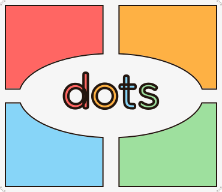

<!-- Improved compatibility of back to top link: See: https://github.com/othneildrew/Best-README-Template/pull/73 -->

<!--
*** Thanks for checking out the Best-README-Template. If you have a suggestion
*** that would make this better, please fork the repo and create a pull request
*** or simply open an issue with the tag "enhancement".
*** Don't forget to give the project a star!
*** Thanks again! Now go create something AMAZING! :D
-->

<!-- PROJECT SHIELDS -->
<!--
*** I'm using markdown "reference style" links for readability.
*** Reference links are enclosed in brackets [ ] instead of parentheses ( ).
*** See the bottom of this document for the declaration of the reference variables
*** for contributors-url, forks-url, etc. This is an optional, concise syntax you may use.
*** https://www.markdownguide.org/basic-syntax/#reference-style-links
-->
[![Contributors][contributors-shield]][contributors-url]
[![Forks][forks-shield]][forks-url]
[![Stargazers][stars-shield]][stars-url]
[![Issues][issues-shield]][issues-url]
[![Apache License 2.0][license-shield]][license-url]
[![LinkedIn][linkedin-shield]][linkedin-url]

<!-- PROJECT LOGO -->
 

  

<h3 align="center">Radical Shapes</h3>

  

    <i>Radical Shapes</i> is a deck building card game about religious trauma and the ways we learn to undo our difficult past. Right now it's still very early in prototyping but it's been a blast to work on!
     
    <a href="https://github.com/ChristopherMackin/philosophy-game"><strong>Explore the docs »</strong></a>
     
     
    <a href="https://github.com/ChristopherMackin/philosophy-game/issues/new?labels=bug&template=bug-report---.md">Report Bug</a>
    &middot;
    <a href="https://github.com/ChristopherMackin/philosophy-game/issues/new?labels=enhancement&template=feature-request---.md">Request Feature</a>
  

<!-- TABLE OF CONTENTS -->

  
Table of Contents

  <ol>
    <li>
      <a href="#about-the-project">About The Project</a>
      <ul>
        <li><a href="#built-with">Built With</a></li>
      </ul>
    </li>
    <li><a href="#roadmap">Roadmap</a></li>
    <li><a href="#license">License</a></li>
    <li><a href="#contact">Contact</a></li>
    <li><a href="#acknowledgments">Acknowledgments</a></li>
  </ol>

<!-- ABOUT THE PROJECT -->
## About The Project

![Radical Shapes Screen Shot][product-screenshot]

(<a href="#readme-top">back to top</a>)

### Built With

* [![Godot][Godot-sheild]][Godot-url]

(<a href="#readme-top">back to top</a>)

<!-- ROADMAP -->
## Roadmap

No current roadmap is planned

See the [open issues](https://github.com/ChristopherMackin/philosophy-game/issues) for a full list of proposed features (and known issues).

(<a href="#readme-top">back to top</a>)

<!-- LICENSE -->
## License

Distributed under the Apache License 2.0. See `LICENSE` for more information.

(<a href="#readme-top">back to top</a>)

<!-- CONTACT -->
## Contact

Christopher Mackin - christopher.daniel.mackin@gmail.com

Project Link: [https://github.com/ChristopherMackin/philosophy-game](https://github.com/ChristopherMackin/philosophy-game)

(<a href="#readme-top">back to top</a>)

<!-- ACKNOWLEDGMENTS -->
## Acknowledgments

* Comming Soon

(<a href="#readme-top">back to top</a>)

<!-- MARKDOWN LINKS & IMAGES -->
<!-- https://www.markdownguide.org/basic-syntax/#reference-style-links -->
[contributors-shield]: https://img.shields.io/github/contributors/ChristopherMackin/philosophy-game.svg?style=for-the-badge
[contributors-url]: https://github.com/ChristopherMackin/philosophy-game/graphs/contributors
[forks-shield]: https://img.shields.io/github/forks/ChristopherMackin/philosophy-game.svg?style=for-the-badge
[forks-url]: https://github.com/ChristopherMackin/philosophy-game/network/members
[stars-shield]: https://img.shields.io/github/stars/ChristopherMackin/philosophy-game.svg?style=for-the-badge
[stars-url]: https://github.com/ChristopherMackin/philosophy-game/stargazers
[issues-shield]: https://img.shields.io/github/issues/ChristopherMackin/philosophy-game.svg?style=for-the-badge
[issues-url]: https://github.com/ChristopherMackin/philosophy-game/issues
[license-shield]: https://img.shields.io/github/license/ChristopherMackin/philosophy-game.svg?style=for-the-badge
[license-url]: https://github.com/ChristopherMackin/philosophy-game/blob/main/LICENSE
[linkedin-shield]: https://img.shields.io/badge/-LinkedIn-black.svg?style=for-the-badge&logo=linkedin&colorB=555
[linkedin-url]: https://www.linkedin.com/in/christopher-daniel-mackin/
[product-screenshot]: images/screenshot.png
[Godot-sheild]: https://img.shields.io/badge/Godot%20Engine-478CBF?logo=godotengine&logoColor=fff&style=flat
[Godot-url]: https://godotengine.org/
